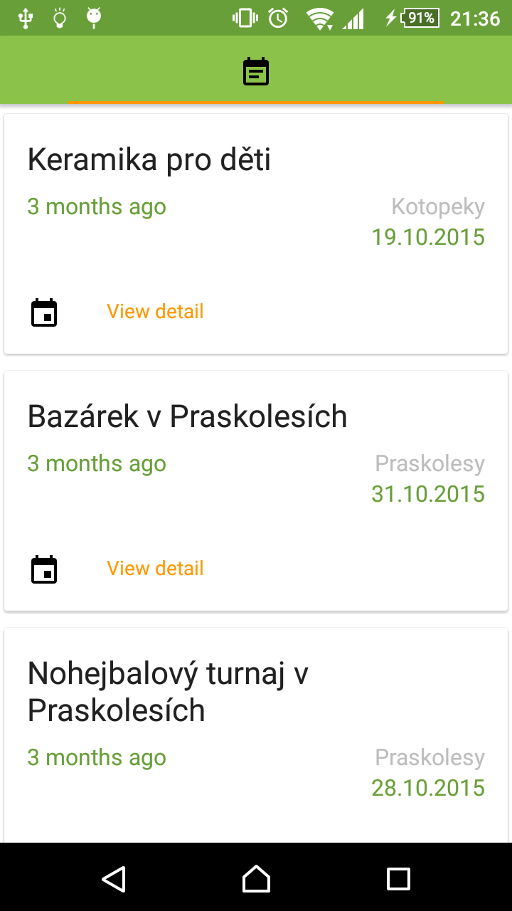
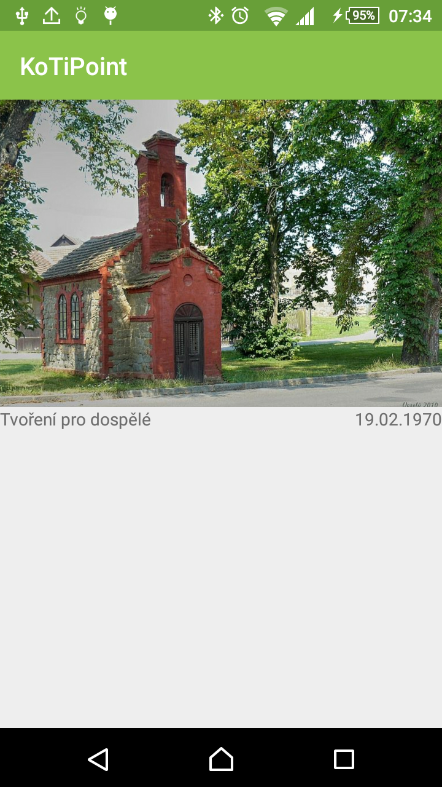
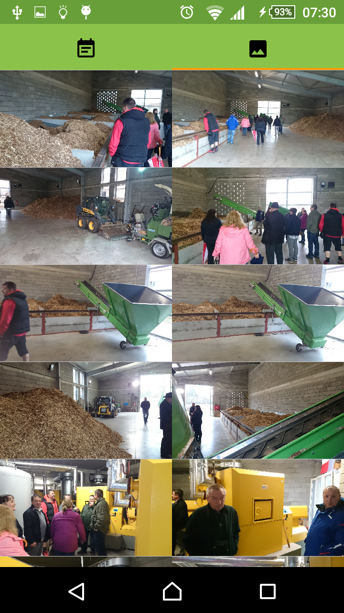
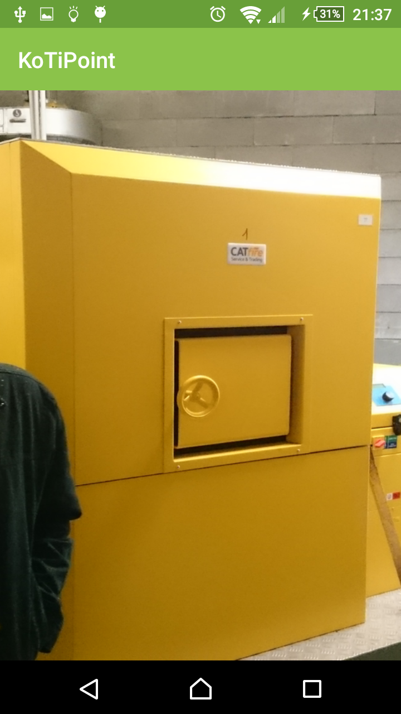

# KoTiPoint
Kotopeky & Tíhava village (K&T) related point.

Features
============

* List of near future (& the history) events related to K&T
* Media (photo) gallery related to K&T

Release notes
============
**History**:
This is third version (&repository) of KoTiPoint app. 
So this version of ap starts with major version set to 3.
Old variants are:
 * [KOTI-POINT](https://bitbucket.org/KotoMisak/koti-point-android)
 * [KO-TI-POINT](https://bitbucket.org/KotoMisak/ko-ti-point-android)
 * [KOTI-PORTAL](./extras/screens/KoTiPortal_KitKat.mp4) - repository since 2014, lost in 2015]

**WTF(What The Feature)** is new in which version.

**_3.1.x.y_** - Basic list of Kotopeky&Tihava events

**_3.2.x.y_** - List of Kotopeky&Tihava events with proper detail

**_3.3.x.y_** - Media gallery  
3.3.3.0 - (dex:31438)
                                                                                             
Documentation
=============
mobile/src/res/raw/kotokeystore.bks - keystore for public key of server certifikate from https://kotopeky.cz to realize ssl verification.

Dependencies
============
* [Android Support Library](http://developer.android.com/tools/support-library/index.html)
* [AppCompat](https://developer.android.com/reference/android/support/v7/appcompat/package-summary.html)
* [GSON](http://code.google.com/p/google-gson/)
* [OkHttp](https://github.com/square/okhttp)
* [Retrofit](https://github.com/square/retrofit)
* [Butterknife](https://github.com/JakeWharton/butterknife)
* [RxAndroid](https://github.com/ReactiveX/RxAndroid)
* [RxJavaMath](https://github.com/ReactiveX/RxJavaMath)
* [GradleRetroLambda](https://github.com/evant/gradle-retrolambda)

Testing
=======

NOT yet :-(

Developed by
============

[Michal Jeníček](https://www.linkedin.com/in/jenicekmichal)

License
=======

        Copyleft ©2015 Michal Jenicek

Screens
============

